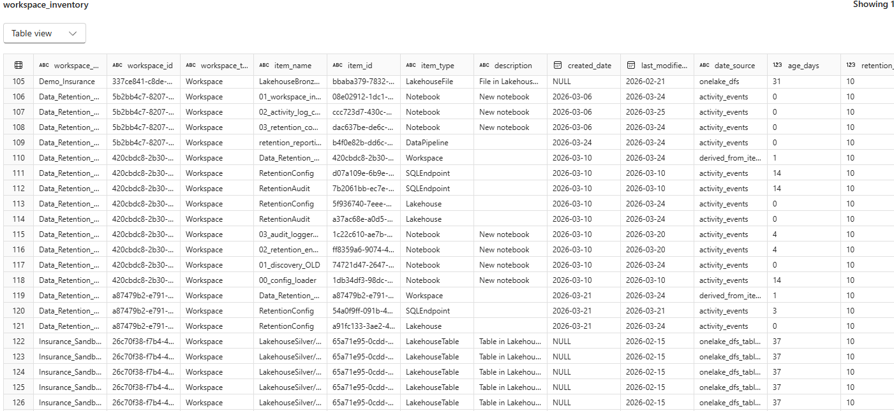

# Notebook 01 — Workspace Inventory

## What Does This Notebook Do?

This notebook creates a **complete inventory of every item across all your Microsoft Fabric workspaces**. Think of it as taking a snapshot of everything your organizations tenant has — every report, semantic model, notebook, pipeline, lakehouse, and more — along with when each item was last created or modified.

## Why Is This Important?

Before you can decide what's old and should be cleaned up, you need to know **what you have** and **when it was last touched**. This notebook answers those questions by scanning every workspace your admin account can see.

## How Does It Work? (Step by Step)

### Step 1 — Connect and List Workspaces
The notebook connects to Microsoft Fabric and retrieves a list of **all workspaces**. It supports two authentication methods:

- **Fabric Credential (default)** — Uses the signed-in user's identity. Returns workspaces your account has access to. Requires the **Fabric Administrator** role.
- **Service Principal** — Uses an Entra ID App Registration with client credentials. Calls the Admin API (`/v1/admin/workspaces`) to list **all** tenant workspaces without needing per-workspace access.

To use Fabric Credential mode, set `use_service_principal = False` in Cell 2 (this is the default — no other changes needed).

To use Service Principal mode, set `use_service_principal = True` in Cell 2 and fill in `sp_tenant_id`, `sp_client_id`, `sp_client_secret`, and `sp_object_id`.

### Step 1b — Bootstrap (Service Principal Only)
When running in SP mode with `sp_object_id` set, the notebook automatically adds the Service Principal as a **Member** to every workspace in the tenant. This step runs each time the notebook executes in SP mode, so newly created workspaces are picked up on subsequent runs.

**What it does:**
- Lists all tenant workspaces using the SP's Fabric API token (Admin API)
- Adds the SP as a **Member** to each workspace using the **signed-in user's identity** (Fabric credential) via the PBI Admin API
- Workspaces where the SP is already a Member are automatically skipped

**Why it's needed:**
- The SP needs workspace-level membership to access lakehouse tables, files, and warehouse metadata via the Fabric REST API and OneLake DFS
- The admin APIs (workspace listing, item listing, activity events) work via tenant settings alone, but sub-item discovery requires per-workspace access

**Why it uses the signed-in user's token:**
- The PBI Admin write API (`POST .../admin/groups/{id}/users`) requires tenant-admin privileges
- The SP itself cannot call this endpoint without Power BI Service write permissions, which conflict with the Fabric REST API and cause 500 errors
- So the bootstrap is a hybrid operation: the SP token reads the workspace list, and the user token writes the membership grants
- The signed-in user must have the **Fabric Administrator** role

### Step 2 — Get Modification Dates (Two Sources)
Getting accurate "last modified" dates in Fabric is tricky because **no single source has all the dates**. This notebook pulls from two different sources:

- **PBI Admin Scanner** — This is a Microsoft API that returns creation and modification dates for classic Power BI items like Reports, semantic models, Dashboards, and Dataflows. It works well for these item types but does **not** cover newer Fabric items.

- **Activity Events API** — This is a second Microsoft API that records user actions (like editing a notebook or updating a pipeline). The notebook looks at these activity records to determine when Fabric-native items (Notebooks, Pipelines, Lakehouses, etc.) were last modified. It only counts **real changes** — simply viewing or opening an item does not count as a modification.

### Step 3 — Set the Retention Period
Before building the inventory, the notebook sets the **retention period** in Cell 4. This is the **single source of truth** for how many days an item can go without being modified before it's considered overdue. The default is **10 days** for demo purposes. You can customize retention per item type (e.g., 90 days for Reports, 180 days for Semantic Models) using the `RETENTION_DAYS_BY_TYPE` dictionary in that same cell.

Notebook 03 reads this value from the inventory table — it does **not** have its own retention setting.

### Step 4 — Build the Inventory Table
The notebook combines everything into a single table called `workspace_inventory`. For **each item**, the table records:

| Column | What It Means |
|--------|--------------|
| **workspace_name** | Which workspace the item lives in |
| **item_name** | The name of the item (e.g., "Sales Report Q4") |
| **item_type** | What kind of item it is (Report, Notebook, Pipeline, LakehouseTable, LakehouseFile, etc.) |
| **item_id** | A unique identifier for the item |
| **created_date** | When the item was first created |
| **last_modified_date** | The most recent date someone made a change to it |
| **date_source** | Where the date came from (PBI Scanner, Activity Events, OneLake DFS, etc.) |
| **age_days** | How many days since the item was last modified (or created) |
| **retention_period_days** | The retention period assigned to this item type |
| **deletion_due_date** | The date when this item would be considered overdue |
| **is_overdue** | Whether the item has exceeded its retention period |

### Step 5 — Discover Sub-Items Inside Lakehouses & Warehouses
The notebook goes one level deeper by scanning **inside** each Lakehouse and Warehouse to discover:
- **Lakehouse Tables** — via the Fabric Tables API, with a fallback to OneLake DFS for schemas-enabled lakehouses
- **Lakehouse Files** — via the OneLake DFS API (recursive scan of the Files/ directory)
- **Warehouse Tables & Views** — via SQL `sys.objects` metadata

Each sub-item gets its own row in the inventory with its own modification date and retention calculation.

### Step 6 — Show a Summary
At the end, the notebook displays a summary showing:
- How many items were found in total (including sub-items)
- How many items were found per workspace
- How many items had dates from each source
- How many items had **no modification date at all** (meaning no one has changed them in the last 28+ days)
- Sub-item counts by type (LakehouseTable, LakehouseFile, WarehouseTable, WarehouseView)

## What Does It NOT Do?

- It does **not delete** anything
- It does **not move or archive** anything
- It does **not change** any settings (except adding SP workspace membership during bootstrap)
- It is completely **read-only** — it just looks and reports

## Authentication Note

The Service Principal path uses Admin APIs to bulk-fetch all workspaces and items tenant-wide, which may return **more results** than the Fabric Credential path (which only sees workspaces your user account has access to). Both paths produce the same output schema.

## How Long Does It Take?

Typically **2–3 minutes**, depending on how many workspaces and items your organization has.

## Output

A Delta table called **`workspace_inventory`** saved in the RetentionConfig lakehouse. This table is used by Notebook 03 to build the retention readiness report. It contains the retention period for each item (set in Cell 4 of this notebook), which serves as the **single source of truth** — no other notebook or config file controls retention days.

### Sample Output

