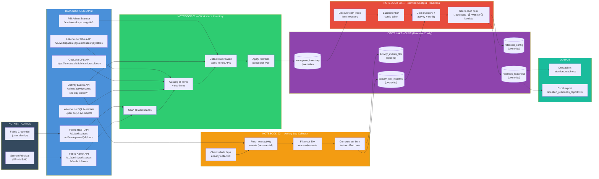
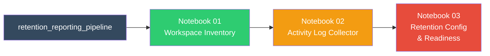

# Fabric Data Retention Reporting — Workflow

## Workflow Diagram

---

## Pipeline Execution

The pipeline runs all three notebooks in sequence: **01 → 02 → 03**. If any notebook fails, the pipeline stops and does not run subsequent notebooks on stale data.

---

## Step-by-Step Explanation

### Data Sources — 6 APIs (Blue)

| # | API | Scope | What It Provides |
|---|-----|-------|-----------------|
| 1 | Fabric REST API | `/v1/workspaces`, `/v1/workspaces/{id}/items` | Lists all workspaces and items (no dates) |
| 2 | PBI Admin Scanner | `/admin/workspaces/getInfo` | createdDateTime, modifiedDateTime for Reports, Datasets, Dataflows, Dashboards, Datamarts |
| 3 | Activity Events API | `/admin/activityevents` | User activity events for the last 28 days (edits, creates, deletes) |
| 4 | Lakehouse Tables API | `/v1/workspaces/{id}/lakehouses/{id}/tables` | Table names, types, formats, lastUpdatedTimestamp |
| 5 | OneLake DFS API | `https://onelake.dfs.fabric.microsoft.com` | File paths with lastModified dates (recursive scan of Files/ and Tables/ directories) |
| 6 | Warehouse SQL Metadata | Spark SQL on `sys.objects` | create_date and modify_date for tables and views |

### Notebook 01 — Workspace Inventory (Green)
- Scans **all accessible workspaces** via the Fabric REST API
- Catalogs every item: name, type, ID, workspace
- Collects modification dates from the **PBI Admin Scanner** (Reports, Datasets) and **Activity Events API** (Notebooks, Pipelines, Lakehouses)
- Discovers **sub-items** inside Lakehouses (tables via Lakehouse Tables API, files via OneLake DFS) and Warehouses (tables/views via sys.objects)
- Applies **retention period** per item type from the `RETENTION_DAYS_BY_TYPE` dictionary in Cell 4 (single source of truth)
- **Overwrites** the `workspace_inventory` Delta table on each run

### Notebook 02 — Activity Log Collector (Orange)
- Fetches activity events from the **Activity Events API** (28-day retention window)
- Runs **incrementally** — checks which days are already collected, only fetches new days
- **Filters out 30+ read-only event types** (views, exports, downloads) so viewing an item doesn't reset its retention clock
- Appends raw events to `activity_events_raw` (preserves history beyond the 28-day API window)
- Computes `activity_last_modified` — one row per item with its most recent modification date

### Notebook 03 — Retention Config & Readiness Report (Red)
- Discovers all item types from the inventory and builds the `retention_config` table
- **Three-way join**: inventory (what exists) + activity (when last modified) + config (how long to keep)
- **COALESCE priority** for dates: activity_id_match → activity_name_match → fabric_api → created_date
- Scores each item:
  - 🔴 **EXCEEDS RETENTION** — not modified within the retention window
  - 🟢 **Within retention** — recently modified
  - ⚪ **No date** — cannot assess (no modification data available)
- Saves `retention_readiness` Delta table and exports to Excel

### Delta Lakehouse — RetentionConfig (Purple)

| Table | Write Mode | Source | Description |
|-------|-----------|--------|-------------|
| `workspace_inventory` | Overwrite | NB01 | Full catalog of all workspace items with dates and retention period |
| `activity_events_raw` | Append | NB02 | Raw activity events (incremental, preserves history) |
| `activity_last_modified` | Overwrite | NB02 | One row per artifact with last modification date |
| `retention_config` | Overwrite | NB03 | Retention period rules per item type |
| `retention_readiness` | Overwrite | NB03 | Final scored readiness report |

### Output (Teal)
- **Delta table** `retention_readiness` — queryable from Spark SQL or Power BI
- **Excel export** `Files/exports/retention_readiness_report.xlsx` — downloadable from the Lakehouse file browser

---

## Authentication

All API calls use `mssparkutils.credentials.getToken()` with the identity of whoever runs the notebook:

| Token Scope | Used For |
|-------------|----------|
| `https://api.fabric.microsoft.com` | Fabric REST API, Lakehouse Tables API |
| `https://analysis.windows.net/powerbi/api` | PBI Admin Scanner, Activity Events API |
| `https://storage.azure.com/` | OneLake DFS API |

For production/scheduled runs, switch to a **service principal** or **managed identity** so notebooks can run unattended.
